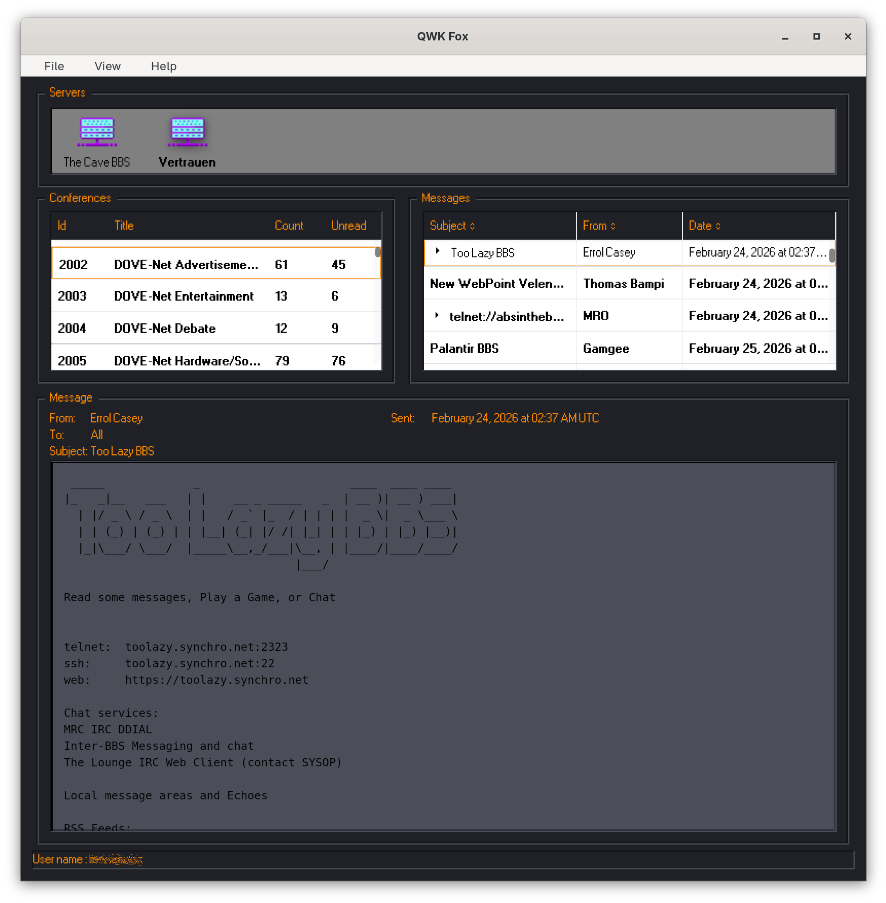

# QWK Fox

A simple offline reader for QWK packets, using Tauri for cross-platform compatibility, backed by SQLite database.

## Download

**[Pre-release](https://github.com/hjcoda/qwk-fox/releases/latest)**: early stages

## Developing

### Recommended IDE Setup

- [VS Code](https://code.visualstudio.com/) + [Tauri](https://marketplace.visualstudio.com/items?itemName=tauri-apps.tauri-vscode) + [rust-analyzer](https://marketplace.visualstudio.com/items?itemName=rust-lang.rust-analyzer)

### Linux

### Running on Wayland

WEBKIT_DISABLE_DMABUF_RENDERER=1 npm run tauri dev

### Windows

- Node, Yarn
- Rustup - Visual Studio Community
- Visual Studio Community - Modify - Add Desktop C++
- Install strawberry perl - https://strawberryperl.com/

### Building locally on Arch Linux

cd src-tauri
cargo clean
cd ..
NO_STRIP=true cargo tauri build --verbose
